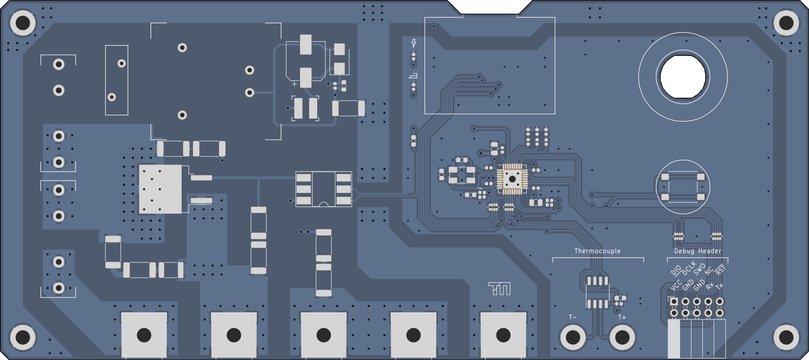
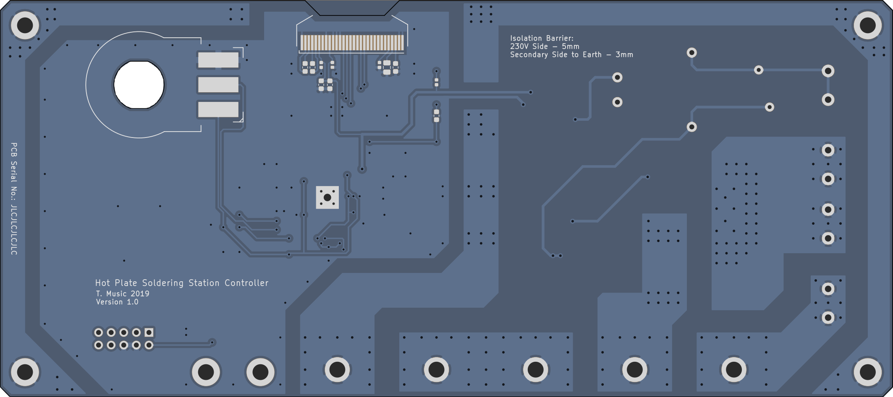

# Hot Plate Soldering Iron

[](https://creativecommons.org/licenses/by-sa/4.0/)

```
WARNING: This project is dealing with 230VAC. You have to take safety preautions and provide proper isolation. Never touch the mains side of the circuit if power is applied. If you are not experienced in high voltage electronics do not attempt to build this circuit. I do take NO WARRANTY or LIABILITY for any damages when building or operating this device.
```

```
Also note: This is a work in progress. The firmware is not yet existing but will be gradually updated 
```

## PCB Design Notes

### Primary Side

#### PSU

Having only done one pcb incorporating 230 VAC and low voltage (before always used old 5 V phone chargers or other PSUs), but on serparate pcbs, I wanted to opt for an all-on-one pcb design. At LCSC.com I found an affordable print switching PSU ([GTL-POWER-VB02](https://datasheet.lcsc.com/szlcsc/1811211452_GTL-POWER-VB02-T2S03_C335526.pdf)), with an output of 3.3 V at 500 mA, which seemed perfect for the job. Their datasheet (at least the parts I could understand with the help of translator) recommended additional filtering at the output, which has been followed by me. Regarding the primary side, either a simple approach consisting out of a fuse, a varistor and a current limiting resistor or a more EMV saving pre-circuit is possible. As this device is just occasionally in use, the protective circuit is good enough for me.

Regarding the power switch for the iron itself, a BT-138 is used. Primarily because I already had this type of TRIAC already in use together with a MOC3083 and know it's working well together. The resistor values are taken from the MOC's datasheet. Because the SMD resistors have a maximum voltage rating of 250 V, I put two of them in series. All of the tracks carrying the heavy load are approximately five millimeters wide, but run on two layers. As a result a current of in total 10 A is achievable, which is limited by the fuse F1. For ease of layouting, the psu (on fuse F2) and iron are sharing F1. As the iron I use has a cold resistance of 42 Ohms, a 6.3 Ampere fuse is sufficient for F1.

The isolation between any track or plane of different nets is at least five millimeters, depending on the necessity I may also apply a thin layer of spray varnish. To protect against touch, the whole pcb will be mounted behind a sheet of plexiglass.

### Secondary Side

Both controller and peripherals are running at 3.3 V. I decided to connect Earth and GND together (at the cost of more EMV). For someone not wanting this, it is possible to just not fit the resistor R21. In contrast to the primary side, the spacing between Earth and GND is not five, but only three millimeters.

The brain of the circuit is an STM32F103 microcontroller in a small QFN package running at a maximum of 72 MHz. Although way to powerful for the application, it has the advantage to be compatible with the Arduino IDE, so others have an easier time programming their own firmware.
The USB interface of the controller has not been broken out onto the pcb. Any firmware can be flashed by using the SWD interface or the bootloader on the STM32, both accessible through the debug pin socket at the bottom. To activate the bootloader, keep the button pressed and reset the device.
I will be sticking to plain C and the STM32 HAL layer though, more to that in the firmware section.

To set the desired temperature, a potentiometer will be used and read out by the microcontrollers ADC. The AVCC pins have not gotten any additional filtering, as the potentiometer used is just for roughly setting the temperature. Although the STM32 provides a 12 bit ADC, only eight bit are necessary and I will just average a few measurements in the firmware.

For starting or interrupting the heating process one further button is present. One can fit a push button directly on the pcb or connect a cable to a button mounted in the plexiglass panel.

#### PCBs View

The PCB graphics have been created using Greg Davill's KiCAD Script. Order was placed at JLCPCB as I still had other PCBs to be made.






## Mounting

Coming soon

## Firmware


Licensed under CC BY-SA 4.0 (https://creativecommons.org/licenses/by-sa/4.0/legalcode)

### PCB

