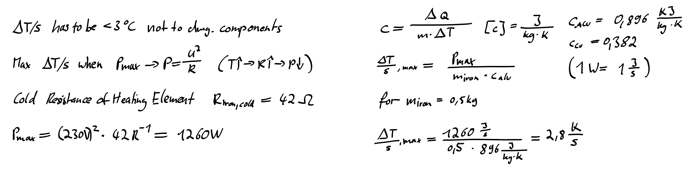

# PCB Toaster

> **WARNING:** This project is dealing with 230VAC. You have to take safety preautions and provide proper isolation. Never touch the mains side of the circuit if power is applied. If you are not experienced in high voltage electronics do not attempt to build this circuit. I do take NO WARRANTY or LIABILITY for any damages when building or operating this device.

## Introduction

In my spare time I have been doing quite a lot of PCBs over the years. Starting with SMD sizes of 1206, with increasing circuit complexity I started using smaller and smaller component sizes. From 1206 over 0805, now ending up at 0402 and my first stenciling "adventures". Whilst browsing Instagram, I stumbled upon [Maker Moekoe's Hot Plate Reflow Iron](https://github.com/makermoekoe/Hotplate-Soldering-Iron), from which I grabbed a bit of inspiration for this quite similar project. As I did not have any spare parts lying around and wanted to do something with higher voltages anyway, I decided to build an all-in-one PCB.
(Fun fact - it is not actually a toaster)

## Roadmap

This current project is still work in progress. Be sure to check back later when it's finished.

- [x] Get an iron and disassemble it
- [x] Do all the calculations on the power side
- [x] Component selection
- [x] Design and order the PCB
- [x] Build and test the PCB
- [x] Plan the case and mounting, get materials
- [x] Take a nap
- [x] PCBs arrive 
- [x] Build and wire everything
- [x] Read up theoretical information about reflow soldering and solder paste
- [x] Program a first firmware version (curious if PID regulator will be necessary or a plain two-point regulator is sufficient)
- [ ] Refine the firmware

## PCB Design Notes

### Primary Side

Having only done one pcb incorporating 230 VAC and low voltage (before always used old 5 V phone chargers or other PSUs), but on serparate pcbs, I wanted to opt for an all-on-one pcb design. At LCSC.com I found an affordable print switching PSU ([GTL-POWER-VB02](https://datasheet.lcsc.com/szlcsc/1811211452_GTL-POWER-VB02-T2S03_C335526.pdf)), with an output of 3.3 V at 500 mA, which seemed perfect for the job. Their datasheet (at least the parts I could understand with the help of translator) recommended additional filtering at the output, which has been followed by me. Regarding the primary side, either a simple approach consisting out of a fuse, a varistor and a current limiting resistor or a more EMV saving pre-circuit is possible. As this device is just occasionally in use, the protective circuit is good enough for me.

Regarding the power switch for the iron itself, a BT-138 is used. Primarily because I already had this type of TRIAC already in use together with a MOC3083 and know it's working well together. The resistor values are taken from the MOC's datasheet. Because the SMD resistors have a maximum voltage rating of 250 V, I put two of them in series. All of the tracks carrying the heavy load are approximately five millimeters wide, but run on two layers. As a result a current of in total 10 A is achievable, which is limited by the fuse F1. For ease of layouting, the psu (on fuse F2) and iron are sharing F1. As the iron I use has a cold resistance of 42 Ohms, a 6.3 Ampere fuse is sufficient for F1.

The isolation between any track or plane of different nets is at least five millimeters, depending on the necessity I may also apply a thin layer of spray varnish. To protect against touch, the whole pcb will be mounted behind a sheet of plexiglass.

### Secondary Side

#### Controller

Both controller and peripherals are running at 3.3 V. I decided to connect Earth and GND together (at the cost of more EMV). For someone not wanting this, it is possible to just not fit the resistor R21. In contrast to the primary side, the spacing between Earth and GND is not five, but only three millimeters.

The brain of the circuit is an STM32F103 microcontroller in a small QFN package running at a maximum of 72 MHz. Although way to powerful for the application, it has the advantage to be compatible with the Arduino IDE, so others have an easier time programming their own firmware.
The USB interface of the controller has not been broken out onto the pcb. Any firmware can be flashed by using the SWD interface or the bootloader on the STM32, both accessible through the debug pin socket at the bottom. To activate the bootloader, keep the button pressed and reset the device.
I will be sticking to plain C and the STM32 HAL layer though, more to that in the firmware section.

For temperature measurement I use the MAX6675 thermocouple measurement IC that is connected via SPI to the STM32. The opto triac to turn on the iron is connected to an I/O and has an indicator LED (iron logo) in parallel.

#### User Interaction

The user in total can interact with the device over one push button, one potentiometer, an OLED display and three LEDs.

To set the desired temperature, a potentiometer will be used and read out by the microcontrollers ADC. The AVCC pins have not gotten any additional filtering, as the potentiometer used is just for roughly setting the temperature. Although the STM32 provides a 12 bit ADC, only eight bit are necessary and I will just average a few measurements in the firmware.
For starting or interrupting the heating process the button is used. One can fit a push button directly on the pcb or connect a cable to a button mounted in the plexiglass panel.

To give the user feedback, a small 128x64 px OLED (displays the current temperature, soldering time, etc...) is connected to the STM32 over SPI. Because there were a few spare I/Os left on the controller, I added three more LEDs that can be turned on or off by the firmware.

### PCB Renders

The PCB renders have been created using Greg Davill's KiCAD Script. Order was placed at JLCPCB as I still had other PCBs to be made. First image is the top, second the bot view.

## Simulation

After the PCB has been sent to the fab, I was curious which performance to expect and decided to coarsely model the hot plate in python.
Even though the script is a bit chaotic and is using really coarse values, the result is surprisingly accurate. Those who are interested and have numpy and matplotlib installed can have a look at the Simulation folder.

### PCB Assembly
The soldering itself went quickly, however I can not really recommend the 0402 resistor networks without a stencil. As the components came from LCSC and these were missing in KiCAD, I drew the footprints of the potentiometer, PSU, fuse holders, as well as the OLED and everything fit like a charm.

## Mounting
In order to prevent the terminals from being touched, an acrylic glass will be mounted on top of it. Two cutouts for the potentiometer and button are made.

The plate itself get really hot and should neither damage the base plate (in case of wood) or steal the heat (in case of metal). As solution it is mounted on a piece of FR4, which is in turn screwed to the base plate.

However I still have not decided if I will make the case out of wood or metal. Until the device is fully finished, the PCB is in a plastic box to prevent touching from the bottom and the Iron is mounted on a wooden plate.

## Firmware
With the hardware done, up to the firmware. 

### Libraries used
For easier scheduling and extensibility I chose to deploy a freeRTOS on the device in conjunction with the STM32 HAL libraries. Then the really good u8g2 library by Oli Kraus for controlling the OLED and finally an own implementation of Brett Beauregard's well working PID controller.

### Iron Power Control

Wave packet control. Prescaler of 8000 @ 64 MHz core clock. Timer in PWM mode with 8000 period -> 1 second. One half wave is 10 ms. error is x

Simulation results show a maximum temperature increase per second of around 2,5 °C. This is below the allowed 3 °C increase per second. When heating the iron with maximum power, it is

As the power of the plate is not high enough support the accurate temperature profile, I will try to take a different approach. At first preheat with maximum heat to 100 °C, at which point the flux starts activating. After the flux is active, the whole soldering process should be completed in three minutes. A PID regulator will then take care of regulating it to the peak temperature.

### Tasks
The first task deals with reading out and preprocessing the thermocouple temperature. The MAX6675 in worst case needs 225ms for one conversion. With SPI at 4 MHz one can achieve four temperature readings in one second. If the value passes the sanity check, it is added to a ringbuffer. This way always the last four temperature readings get averaged providing a stable temperature reading once per second, matching our PID regulator's calculation interval.

The second task is 

control task. Oled, logging and 

pid task. PID regulator based on brett beauregards code.

Currently only one temperature curve is programmed for the Chipquik TS391AX50 (Sn63/PB37, TAL@183 °C). The potentiometer is 

&copy; T. Music 2019 This work is licensed under CC BY-SA 4.0 (https://creativecommons.org/licenses/by-sa/4.0/legalcode)

